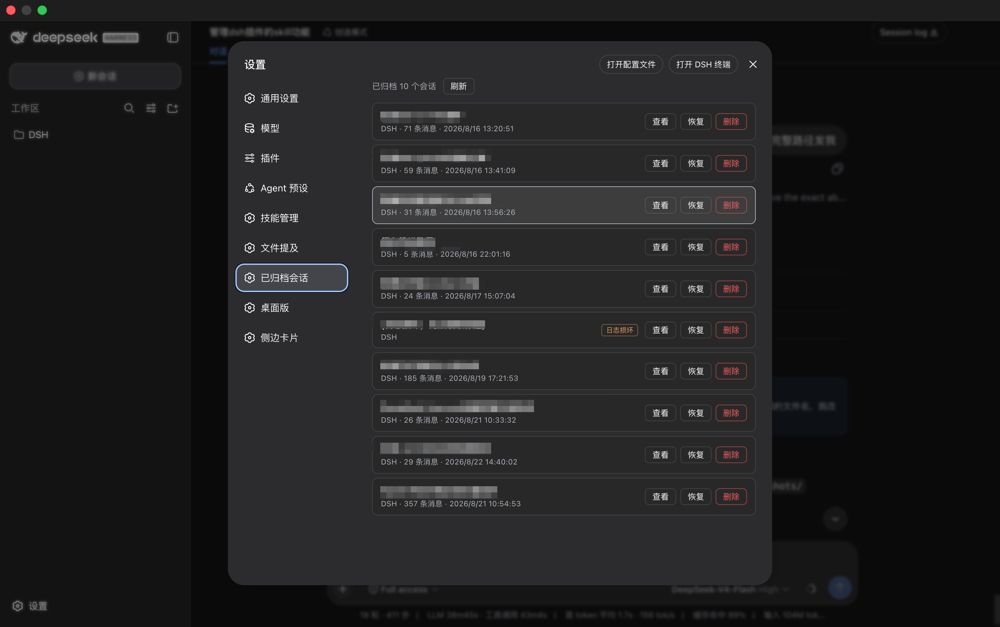
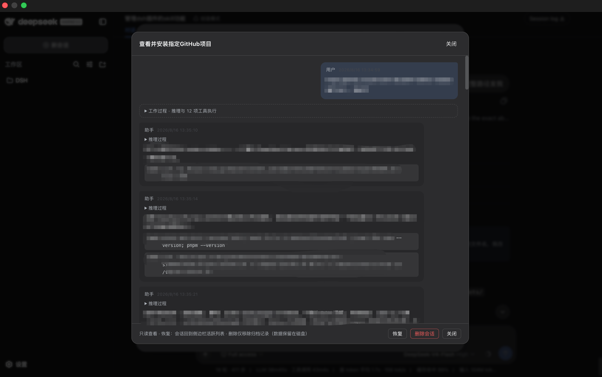

# dsh-archived-sessions

> 查看、**恢复**和删除 DSH（DeepSeek Harness）中已归档的会话：在设置页找回归档列表、阅读完整对话（轮次 / 推理 / 工具执行 / Markdown 表格），一键把归档会话**恢复回侧边栏活跃列表**。桌面端与 Web 端通用。

DSH 中「归档会话」后，会话会从所有界面消失且没有官方入口找回。这个插件在设置面板新增「**已归档会话**」页面，把归档列表找回来，并支持**取消归档（恢复）**。

## 截图

<!-- 把截图放到 docs/screenshots/ 后，在下方按 `` 填入 -->



## 功能

- **归档列表**：标题、所属工作区、消息数、最后活跃时间一目了然；支持刷新；**v0.3.0 起**每页 10 条分页，并支持按**标题 / 工作区**即时搜索过滤。
- **对话查看器**：点击会话弹出只读对话流（弹窗覆盖在设置面板之上，关闭后回到列表）。
  - 按**轮次**分组，每轮把「工作过程」（推理、工具调用、命令执行）折叠起来，最终回答清晰呈现；
  - Markdown 渲染：标题、无序/有序列表、引用、链接、代码块（自动美化 JSON）、**表格**（可横向滚动）；
  - 工具执行以终端卡片展示：工具名、状态点（成功/失败）、`$` 命令行、可展开的输出；
  - 系统注入的消息（运行上下文快照、技能清单等）单独折叠，不会和用户消息混淆。
- **恢复归档会话**（v0.2.0+）：两步确认，把归档会话**取消归档**，回到侧边栏活跃列表的原位置。
  - 入口有两个：归档列表每个会话行右侧的「恢复」按钮；**v0.2.3 起**会话详情弹窗页脚也有「恢复」按钮。
  - DSH 只有 `archiveSession` 没有取消归档 API，本插件通过 workspace 注册表自己的存储域（`storageDomain.get('workspace').global`）把会话 id 从 `archivedSessionIds` 移除——与产品归档共用同一条持久化写入链，改动实时生效、重启后保持，并会清除该会话在本插件中的墓碑记录。
- **删除归档记录**：两步确认，从归档列表移除。DSH 产品本身没有会话删除 API，因此实现为「墓碑」——会话保持归档状态（产品 UI 永远隐藏它），数据文件保留在磁盘（与产品行为一致）。

## 安装

`dsh plugin` 必须指定 `--profile`（对应你要装到的运行环境）：

```bash
# DSH Desktop 桌面应用
dsh plugin --profile desktop add @jiangdaoli/dsh-archived-sessions
# 或 dsh web
dsh plugin --profile web add @jiangdaoli/dsh-archived-sessions
```

（`desktop` 是 DSH Desktop 应用使用的 profile 名，`web` 对应 `dsh web`；用了自定义 profile 就换成自己的名字。）安装后重启 DSH，在 **设置 → 已归档会话** 查看。

> **请从 npm 安装**（上方的包名）。GitHub 仓库只包含源码，构建产物（`lib/`）在发布时由 CI 生成，从仓库直接安装会缺文件。从源码安装请先 `pnpm install && pnpm build`。

## 工作原理

- **Host 半部**（`src/index.ts` → `runtime.ts`）：通过官方 DSH 服务读取数据 —— `workspaceRegistry`（归档集合）、`sessionQuery`（标题 / 对话投影）、`sessionPersistence.readRaw`（损坏日志的宽松兜底）。经 Typert Remote 暴露 `archived/list`、`archived/surface`、`archived/delete`、`archived/restore`。
  - 删除只写入插件自己的 settings 命名空间（墓碑）；
  - 恢复通过 `storageDomain` 写入 workspace 域（从 `archivedSessionIds` 移除），从不改动会话数据本身。
- **Client 半部**（`src/client/index.ts`）：挂载 Remote 命名空间，注册 `settings.section`（id `archived-sessions`）。查看器在设置面板内部渲染，天然处于最顶层。
- **兼容性**：只使用官方 DSH contract，不注入任何 desktop 专属 service，桌面端 / Web / CLI 均可用。

## 开发

```bash
pnpm install
pnpm build   # esbuild 单文件 host + client 产物到 lib/
pnpm typecheck
```

## 说明与限制

- 删除仅移除归档记录；会话数据保留在磁盘（DSH 从不删除会话数据）。
- 日志损坏（seq 缺口）的会话会显示「日志损坏」标记，打开时展示可解析的部分内容。
- 恢复（取消归档）写 workspace 存储域的 `archivedSessionIds`——这是该数据的唯一持久位置，与产品归档动作共用写入链；会话数据本身不被触碰。
- **继续对话**：恢复后会话回到侧边栏活跃列表，点开即可继续对话（原会话、原日志，直接接着聊）。

## 更新日志

各版本变更见 [CHANGELOG.md](CHANGELOG.md)；GitHub Releases 同步发布说明。

## License

MIT
